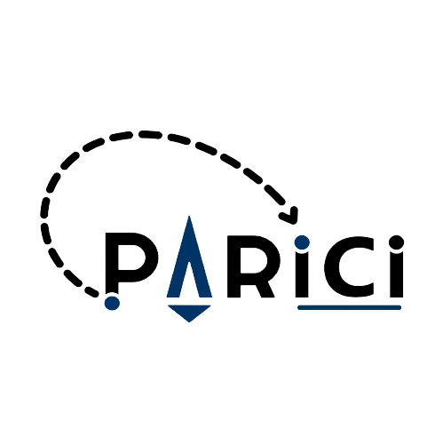

<p align="center">
  
</p>

## <p align="center"> Découvrez les petites commercants de Paris avec Parici </p>

"Parici" est un proof of concept (POC) créé dans le cadre du projet final de Hetic ayant pour but de vous faire découvrir le Paris des petits commerces.<br/> 

En effet, l'activité des petits commerçants sur Paris est vivante mais nombre d'entre-nous n'avons pas idée de cette richesse tant nous sommes pris dans nos habitudes. Nous connaissons les commerces de notre quartier ou allons dans les grands magasins. 

Ce POC vise à faire découvrir cette richesse du petit commerce en proposant des circuits sur Paris que l'on peux faire sur une journée ou une aprés-midi. Au lieu de devoir aller soit-même rechercher les commerces et les circuits, Parici vous facilite la tâche : vous concevez votre circuit avec aisance grâce à des propositions automatisées ou alors vous découvrez un circuit déjà créé par d'autres.  

### But du projet

Le premier but est de valoriser le petit commerce en proposant cette idée d'application. 

Le but est aussi pédagogique: apprendre à utiliser des technologies comme Node.js et React.js.

### Installation 

Pour réaliser l'installation vous avez besoin : 
- Installer Node.js en suivant les étapes sur <a href=" https://nodejs.org/fr/"> ce site (préférez la version stable) </a>. 

 0. `NPM` ou `Yarn` sont requis
 1. Installer les modules `NPM`:
    ```sh
    npm i ou npm install
    ```
    
 2. Pour démarrer l'environnement de développement:
    ```sh
    npm start
    ```


### Equipe: 

- [Farmata SIDIBE](https://github.com/Farmata-sidibe)
- [Amaury FRANSSEN](https://github.com/ExploryKod) 
- [Nachmia MOHAMED](https://github.com/Nachmia)

### Technologies : 
   
   
   
   
   
   
   
   
 
